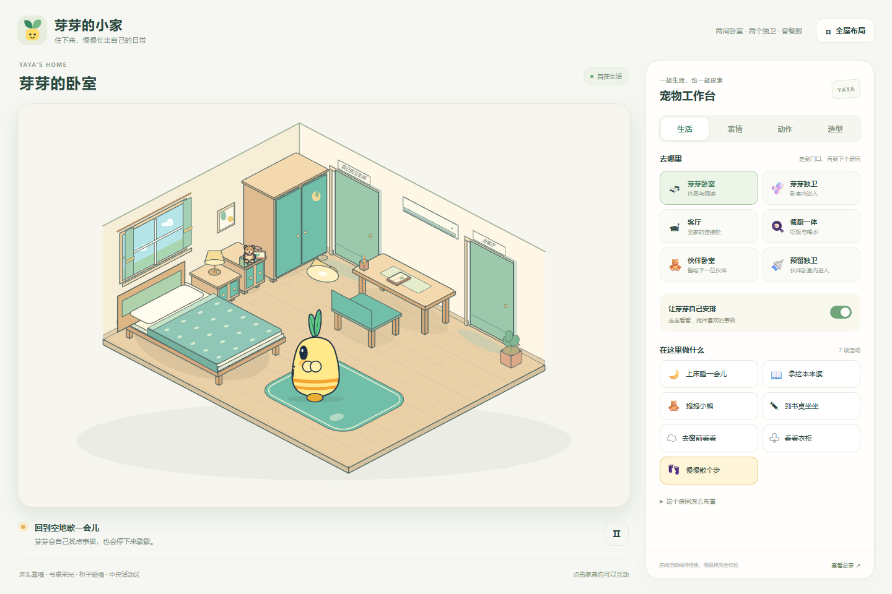

# Pet Building · Bright Cartoon Pet Animation Kit

这是一个用程序制作明亮卡通电子宠物的可复用项目。当前示例角色是芽芽（Yaya）：适合学龄前儿童和学习机屏幕，支持 31 种表情与状态、19 个基础动作，以及一个包含六个空间、可以走门换房和使用家具的小家。

给其他 agent 的设计和实现经验见 [PET_BUILDING.md](PET_BUILDING.md)。它记录了明亮卡通风格的造型规则、情绪表达方法、固定腮红手臂锚点、动画节奏、渲染流程和验收清单。

首页使用左侧实时房间、右侧综合工作台。家里有芽芽卧室及其独卫、伙伴卧室及其独卫、公共客厅、餐厨一体空间。两间卫生间分别从自己的卧室进入；客厅连接两间卧室和餐厨。房间从斜上方观察，床头、书桌和柜子靠墙，窗、顶灯、空调和门都有明确位置，中间保留可行走的通路。

芽芽会沿家具间的通路走到目标，在门口离开、从配对房门进入下一间房；阅读、抱熊、上床休息、书桌与沙发坐下、餐桌吃喝、洗手等活动由当前房间的家具决定。绘本和小熊只由柜子或真实双手中的一方持有，用完再归还。技术说明见 [YAYA_HOME.md](docs/YAYA_HOME.md)。



工作台分成「生活、表情、动作、造型」四个页签。生活页选择房间与活动；表情和动作共用一个预览区；三视图、骨架和叶子研究按需打开大窗口。全屋布局与能力总表也是按需查看，主页面不再连续堆叠所有实验面板。交互协议见 [YAYA_WORKBENCH.md](docs/YAYA_WORKBENCH.md)。

`src/yaya-catalog.js` 保留 31 个外显状态、基础动作与旧卧室行为目录；**当前六空间的真实能力读取 `YayaHomeLayout.rooms[id].activities`**。完整的 [表情分类、动作表与生活机制](docs/YAYA_LIFE_CATALOG.md) 说明了情绪与需求的区别。自主活动使用当前房间的可用动作与间隔，尚未接入旧花园的饥饿、口渴等需求数值。画画、浇花、整理任意散落玩具仍是后续能力。

## 芽芽电子宠物

打开 `outputs/yaya-pet/index.html` 查看当前离线工作台，也可直接打开 `outputs/yaya-pet/home.html` 查看小家。角色源码在 `src/yaya-pet.js`，配置在 `src/config-yaya-pet.js`，详细角色说明在 [YAYA.md](YAYA.md)。

当前家居架构：

| 文件 | 职责 |
| --- | --- |
| `src/yaya-home-layout.js` | 六空间、成对房门、家具占地、可站位置与活动能力 |
| `src/yaya-home-art.js` | 统一斜上方投影、墙面、地板、家具与接触参照 |
| `src/yaya-home-model.js` | 家具避让、跨房路线、行为队列、物品所属和连续状态 |
| `src/yaya-home.js` | 使用原有角色与短手求解器绘制房间活动 |
| `src/yaya-home-ui.js` | 单一时钟、暂停、点击物品与 iframe 指令 |
| `src/yaya-workbench.js` / `.css` | 右侧工作台、分类预览、全屋图与能力表 |

运行 `node test-yaya-home.mjs` 检查房间数据、路径和接触连续性；运行 `node test-yaya-workbench.mjs` 检查主页面与房间通信、分类预览、弹层及移动布局。

历史样例继续保留：`gallery.html` 是旧花园、卧室与素材图库页面，`bedroom.html` 是原二维侧床卧室。它们分别由 `test-yaya-output.mjs`、`test-yaya-life-page.mjs` 和 `test-yaya-bedroom.mjs --browser` 回归验证。旧卧室设计经验见 [YAYA_BEDROOM.md](docs/YAYA_BEDROOM.md)；9 段花园流程仍可用于研究需求调度，但不随新首页同时启动。

This is a small starter kit with code, instructions and assets for animating a character in [p5.js](https://p5js.org) and [p5.brush](https://github.com/acamposuribe/p5.brush) with Claude Opus 5.5. It's based on the code from the music video [I'm Upping My P(doom)](https://github.com/JohnHeibel/PDoomVideo) and an analysis of what the model did and didn't do well. I highly recommend playing around with your prompting: make it give you the storyboard before coding, give it very broad instructions, try being very specific, ask for subagents, and try a bunch of other fun ways of testing the model's capabilities. In my testing, it can do a lot with very little, but it's also quite accurate when you give it more requirements. Also try asking the model to swap out the character or make new emotions or costumes, give it your own reference images, and try many other fun things like that. I've found that the reasoning level corresponds to how "extravagant" and detail-oriented the model makes the scene. All test videos were generated with Opus 5.5 on xhigh reasoning in Claude Code.


## Make a video

Clone it, open it in Claude Code (or any coding agent) and ask for what you want:

> Read ANIMATION_GUIDE.md, then make a 15-second video of Clawd trying to catch a butterfly.

The model storyboards first, builds shot by shot, renders contact sheets to check its own work, and writes `out/video.mp4`. [ANIMATION_GUIDE.md](ANIMATION_GUIDE.md) holds the rules it follows: handmade, alive, one piece, no text, transitions always, something happens in every scene, and a solid medium of brush strokes, flat 2D and boiling linework. It also covers timing for the viewer and the core principles of character animation.

## Run it yourself

You need Node.js, Google Chrome and ffmpeg.

Without a dedicated GPU, p5.brush's watercolour fills make render times fairly slow, measured in seconds per frame. If you're running on integrated graphics, I recommend asking the model to avoid those fills and replace them with something else appropriate. (I love the look of the watercolours, though.)

```bash
npm install
node render.mjs --clip --out=out/video.mp4
```

That renders the 11-second demo in [src/scenes/demo.js](src/scenes/demo.js). Open [studio.html](studio.html) in Chrome to scrub through it. Add `?loop=emotions` or `?loop=views` to see the model sheets. If Chrome isn't in a standard location, pass `--chrome=<path>` or set `CHROME_PATH`.

On Linux, `render.mjs` starts Chrome with `--no-sandbox` (Ubuntu 23.10+ blocks Chrome's sandbox in headless use) and also finds a Chromium installed by Playwright. With no GPU at all, add `--soft-gl` to render WebGL in software: slow on watercolour fills, but it works. On a headless Linux machine with an NVIDIA GPU (a cloud or cluster node), add `--gpu-angle=gl-egl` (or `vulkan`); `node gpu_probe.mjs <chrome path>` shows which renderer each set of flags gets.

## What's here

| path | what it is |
|---|---|
| [ANIMATION_GUIDE.md](ANIMATION_GUIDE.md) | The rules, the workflow and the full API. Read it first. |
| [src/clawd.js](src/clawd.js) | Clawd: views, emotions, eyes, mouths, hats, emotes, dances |
| [src/core.js](src/core.js) | Painting, timing, motion helpers, camera, light, paper |
| [src/timeline.js](src/timeline.js) | Shots, loops and the brush-wipe transition |
| [src/config.js](src/config.js) | Length and tempo |
| [src/scenes/](src/scenes/) | Your video goes here (the demo is an example) |
| [render.mjs](render.mjs) | Headless renderer: contact sheets, frame strips, crops, stills, MP4 |
| [docs/](docs/) | Model sheets: [emotions](docs/emotions.jpg) (also [animated](docs/emotions.webp)) and [views, motion and hats](docs/views.jpg) |
