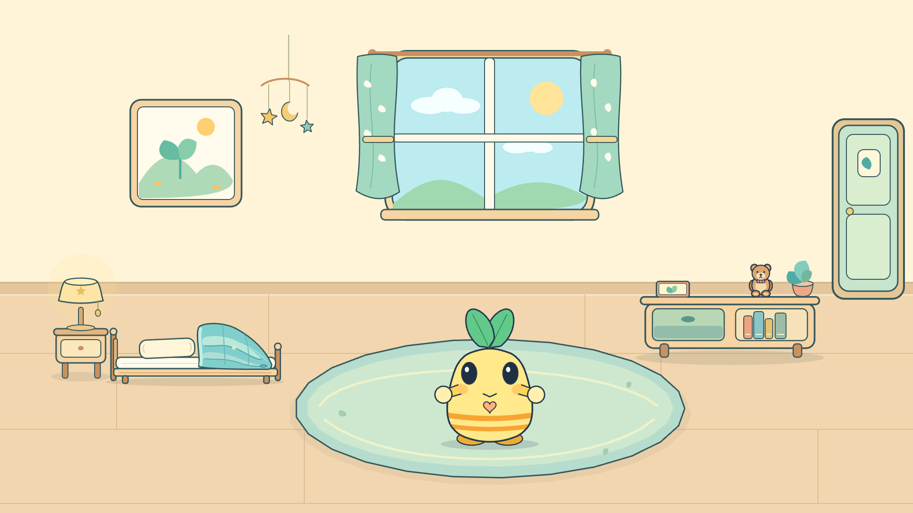

# Pet Building · Bright Cartoon Pet Animation Kit

这是一个用程序制作明亮卡通电子宠物的可复用项目。当前示例角色是芽芽（Yaya）：适合学龄前儿童和学习机屏幕，支持 31 种表情与状态、19 个基础动作、9 段花园生活流程，以及一个可以连续活动、拿放物品的互动卧室。

给其他 agent 的设计和实现经验见 [PET_BUILDING.md](PET_BUILDING.md)。它记录了明亮卡通风格的造型规则、情绪表达方法、固定腮红手臂锚点、动画节奏、渲染流程和验收清单。

首页现在直接显示芽芽的卧室：低床、枕头、被子、床头灯、矮柜、绘本、小熊和活动地毯都有固定位置。可点选物品，也可让芽芽自己安排看窗外、阅读、抱熊、散步和小睡。书和熊由同一对真实短手取走并放回；上床、仰卧、拉被子、起床和下床在同一个房间中连续完成。技术说明及其他 agent 的调用入口见 [YAYA_BEDROOM.md](docs/YAYA_BEDROOM.md)。



完整的 [表情分类、动作表与生活机制](docs/YAYA_LIFE_CATALOG.md) 区分情绪、认知、社交态度和身体需求。机器可读目录 `src/yaya-catalog.js` 分别提供基础 `actions` 与 7 个卧室 `roomBehaviors`。原花园行为引擎 `src/yaya-life.js` 保留在页面下方，默认暂停；卧室使用 `src/yaya-bedroom-model.js` 的空间行为队列，暂未接入花园的需求数值。画画、浇花、整理散落玩具、洗手仍明确列为待开发。

## 芽芽电子宠物

打开 `outputs/yaya-pet/index.html` 可以直接查看离线页面。角色源码在 `src/yaya-pet.js`，配置在 `src/config-yaya-pet.js`，详细角色说明在 [YAYA.md](YAYA.md)。

也可直接打开 `outputs/yaya-pet/bedroom.html`。验证卧室运行 `node test-yaya-bedroom.mjs --browser`；生成关键阶段检查图运行 `node render-yaya-bedroom-review.mjs`。Chrome 路径可通过测试脚本的 `CHROME_PATH` 指定。

This is a small starter kit with code, instructions and assets for animating a character in [p5.js](https://p5js.org) and [p5.brush](https://github.com/acamposuribe/p5.brush) with Claude Opus 5.5. It's based on the code from the music video [I'm Upping My P(doom)](https://github.com/JohnHeibel/PDoomVideo) and an analysis of what the model did and didn't do well. I highly recommend playing around with your prompting: make it give you the storyboard before coding, give it very broad instructions, try being very specific, ask for subagents, and try a bunch of other fun ways of testing the model's capabilities. In my testing, it can do a lot with very little, but it's also quite accurate when you give it more requirements. Also try asking the model to swap out the character or make new emotions or costumes, give it your own reference images, and try many other fun things like that. I've found that the reasoning level corresponds to how "extravagant" and detail-oriented the model makes the scene. All test videos were generated with Opus 5.5 on xhigh reasoning in Claude Code.


## Make a video

Clone it, open it in Claude Code (or any coding agent) and ask for what you want:

> Read ANIMATION_GUIDE.md, then make a 15-second video of Clawd trying to catch a butterfly.

The model storyboards first, builds shot by shot, renders contact sheets to check its own work, and writes `out/video.mp4`. [ANIMATION_GUIDE.md](ANIMATION_GUIDE.md) holds the rules it follows: handmade, alive, one piece, no text, transitions always, something happens in every scene, and a solid medium of brush strokes, flat 2D and boiling linework. It also covers timing for the viewer and the core principles of character animation.

## Run it yourself

You need Node.js, Google Chrome and ffmpeg.

Without a dedicated GPU, p5.brush's watercolour fills make render times fairly slow, measured in seconds per frame. If you're running on integrated graphics, I recommend asking the model to avoid those fills and replace them with something else appropriate. (I love the look of the watercolours, though.)

```bash
npm install
node render.mjs --clip --out=out/video.mp4
```

That renders the 11-second demo in [src/scenes/demo.js](src/scenes/demo.js). Open [studio.html](studio.html) in Chrome to scrub through it. Add `?loop=emotions` or `?loop=views` to see the model sheets. If Chrome isn't in a standard location, pass `--chrome=<path>` or set `CHROME_PATH`.

On Linux, `render.mjs` starts Chrome with `--no-sandbox` (Ubuntu 23.10+ blocks Chrome's sandbox in headless use) and also finds a Chromium installed by Playwright. With no GPU at all, add `--soft-gl` to render WebGL in software: slow on watercolour fills, but it works. On a headless Linux machine with an NVIDIA GPU (a cloud or cluster node), add `--gpu-angle=gl-egl` (or `vulkan`); `node gpu_probe.mjs <chrome path>` shows which renderer each set of flags gets.

## What's here

| path | what it is |
|---|---|
| [ANIMATION_GUIDE.md](ANIMATION_GUIDE.md) | The rules, the workflow and the full API. Read it first. |
| [src/clawd.js](src/clawd.js) | Clawd: views, emotions, eyes, mouths, hats, emotes, dances |
| [src/core.js](src/core.js) | Painting, timing, motion helpers, camera, light, paper |
| [src/timeline.js](src/timeline.js) | Shots, loops and the brush-wipe transition |
| [src/config.js](src/config.js) | Length and tempo |
| [src/scenes/](src/scenes/) | Your video goes here (the demo is an example) |
| [render.mjs](render.mjs) | Headless renderer: contact sheets, frame strips, crops, stills, MP4 |
| [docs/](docs/) | Model sheets: [emotions](docs/emotions.jpg) (also [animated](docs/emotions.webp)) and [views, motion and hats](docs/views.jpg) |
