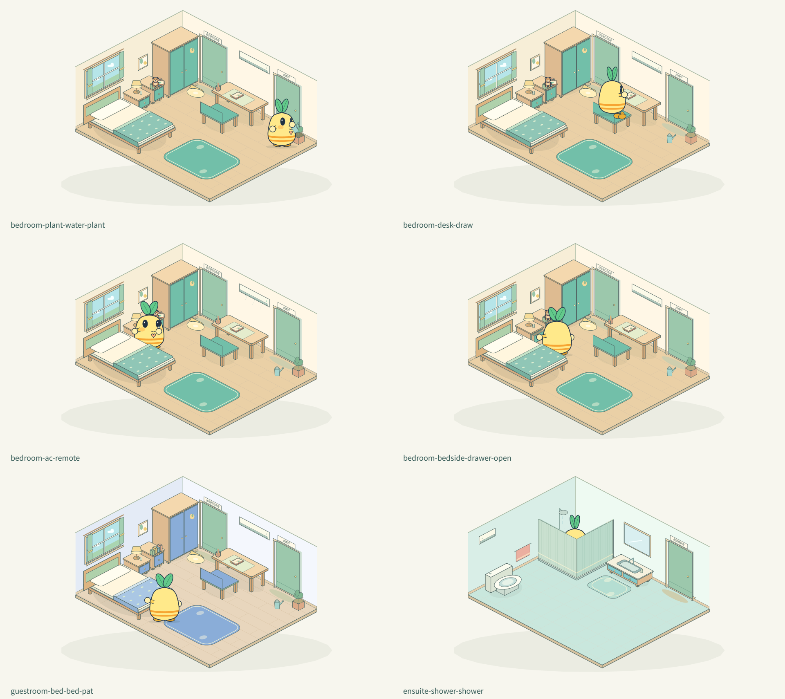
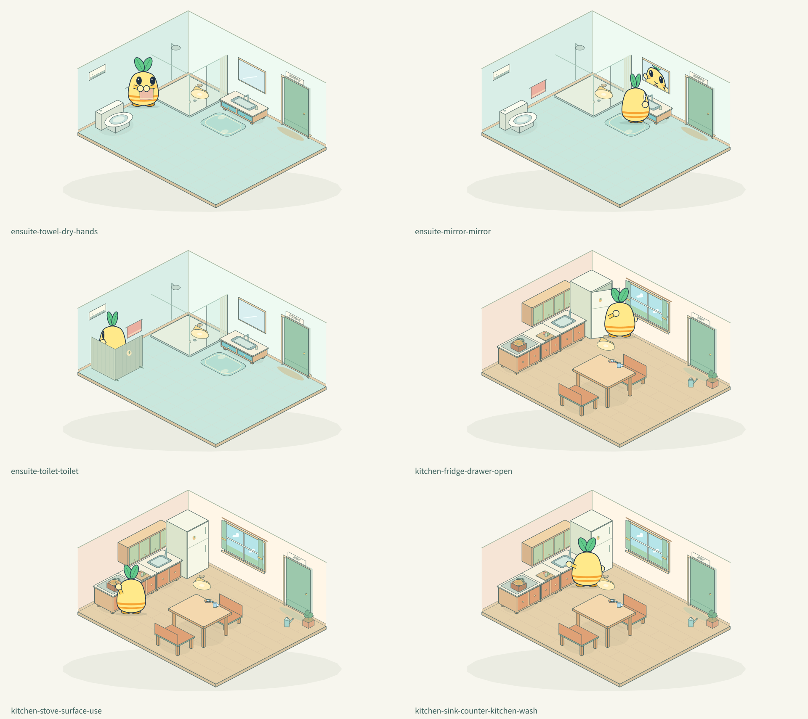
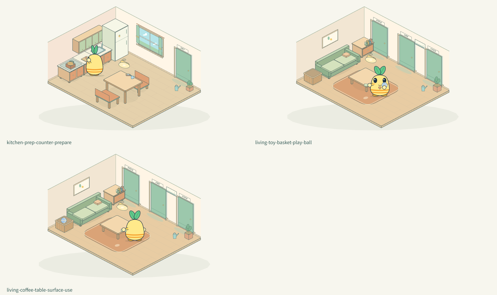

# 全屋物品交互与自然性验收

这一轮的目标是让同一只芽芽在真实家具之间持续生活。当前六个房间共有 75 个物品操作入口，以及 10 扇成对连接的门。75 是入口数量，包含不同房间的同类家具以及物品快捷入口，不代表 75 套互不相关的骨架。

## 先有接触关系，再有动画

1. **明确物品的支撑面和握点。** 一个物品由 surface 或 hand 中的一方持有；手达到同一个世界握点后才切换所属。球在篮内与手上直接复用同一绘制函数。
2. **反求站位，保持短胳膊。** 腮红高度的肩根不动，圆手半径不变，最大伸展仍为 2.05 个身体单位。够不到时调整家具、工具朝向或角色站位；不能用拉长手臂掩盖布置错误。
3. **检查工具末端。** 汤勺的勺头需要落在锅里；笔尖需要落到纸上；壶嘴流出的水要进花盆。先从接触点扣掉工具在掌心上的偏移，再反投影得到握点。
4. **站位还要让观众看见。** 可达不等于可读。擦桌、浇花、冰箱、洗手和抚被子需要让掌心及接触面露在身体轮廓外。否则数学上触到了，画面仍像摸脸。
5. **物品必须露出手掌。** 掌心是饱满的小圆球，不能把更小的遥控器、擦布和球全藏在它后面。握住遥控器下部，布露出边缘，玩球放在胸前而非遮住眼睛。
6. **使用后收手再转向。** 固定的接触目标只用于当前站位；步行和转身前收回随 yaw 更新的持物姿势。否则下一次转身会把上一个动作的掌心坐标当成新身体上的点，造成断手或长胳膊。
7. **接触与遮挡同样重要。** 近手可以在物体前面，远侧物品应由躯体遮挡。吃饭的桌面在身体之后、前臂和手掌之前绘制。镜中倒影裁切到镜框内，退出照镜阶段就消失。

## 路线规则

空地中先做整段直线可见性检查，通过就只保留起点和终点，直接斜走；遇到家具才用家具扩张边界的可见图找任意角度的路线。转角用小圆弧平顺衔接，并逐段验证圆弧不能切进家具。没有重新吸附到网格的步骤。到达原地时保留原朝向，不为了零长度路线多转一次身。

导航使用家具占地以及角色落脚宽度的扩张范围。坐上椅子、进入淋浴区、上床是明确的支撑物过程，不能作为普通步行穿过障碍。跨房间先走到真实门把手，短手推开一小段并松手，门继续转开，角色通过门洞；抵达另一边后停在门内安全位置，不强制多走一趟房间中心。

## 完整使用过程

| 家具／物品 | 当前过程 |
| --- | --- |
| 床 | 到床边、上床、钻进已铺好的被子、仰卧、醒来坐起、下床；伙伴床仅整理，不自动占用 |
| 书与小熊 | 柜面接触、拿起、带到活动区、阅读翻页或抱抱、带回、放稳、松手 |
| 书桌与笔 | 坐到真实椅面，小脚朝前垂下，拿纸边的笔、落笔画画、归位、起身 |
| 床头柜／书柜／衣柜／冰箱 | 握住同一把手、跟随开启、停留查看、扶着合好、收手 |
| 餐桌 | 坐自己的餐椅，勺尖从碗到嘴；喝水时拿原来的杯子，放回后离席 |
| 备餐台与汤锅 | 在操作台边整理已有水果；取真实汤勺，将勺头伸入锅里搅拌，再放回 |
| 洗手台与毛巾 | 龙头下接水、胸前搓洗、再冲洗；毛巾另有拿下、擦手、挂回的完整过程 |
| 淋浴／坐便器 | 进入真实区域或坐上便座；感应帘／屏风展开；结束关水、展开通道；淋浴后擦手，如厕后去洗手台洗手 |
| 茶几／擦布 | 拿布、从桌边接触桌面、擦拭、放回，不把布藏在圆手后面 |
| 球与玩具篮 | 篮中拿球、走到空地、在胸前轻轻转球、回篮旁归位 |
| 花盆与小壶 | 拿壶、侧面站稳、壶嘴靠近盆上方、倾斜浇水、放回原来的地面位置 |
| 空调、顶灯、吊柜 | 拿柜面上的遥控器、操作、看到设备状态改变、放回；吊柜看完关好 |
| 窗、画、镜子 | 走到可观察的位置再看，镜子显示镜框内的近尺度倒影 |
| 地毯／防滑垫／椅子／沙发 | 走到空处再伸展、擦脚或坐下，座面和身体保持支撑关系 |

自动感应设施在画面上有感应标记；不能把没有手部接触的开合描述为“亲手拉帘”或“按下按钮”。被子保留在床面，角色进入和离开，不再让无人拉动的被子自动伸长收缩。

## 连续生活和手动接管

自主生活在自己的卧室、独卫、客厅、餐厨选择完整活动；每几项基础活动穿插画画、浇花、擦桌、玩球或厨房家务。同一种新日常至少间隔 180 秒。伙伴卧室及独卫只供手动参观，不自动占用。

拿着道具时请求换房，先完成归还；睡着时先起身下床。收到新安排后缩短纯等待，保留拿放和转身本身的连续过程。跨房途中不接受旧房间物品或地板位置的指令，明确提示先到目的房间；连续点同一项不会重复排队。暂停和后台暂停冻结同一时钟。

当前是固定家具与预设接触点上的 2.5D 动作系统，不是任意物体的通用三维刚体模拟。装饰性书脊等随所属家具交互，不单独生成可任意拖拽的新物品。饥饿、疲劳、昼夜数值还未接入六空间的自主决策。

## 逐项目录

下表由当前 YayaHomeInteractions.list 生成。新增家具需要同时补足目录、站位、使用、归还与热点，不能只有画面或按钮。

### 芽芽的卧室

| 物品 | 命令 | 当前行为 |
| --- | --- | --- |
| 芽芽的小床 | `object:bed` | 先到床边，坐上床沿，再躺进铺好的被子里休息 |
| 床头柜 | `object:bedside` | 握住低抽屉，拉开看看，再合好 |
| 床头灯 | `object:bedside-lamp` | 短手碰到灯座才切换灯光 |
| 衣柜 | `object:wardrobe` | 扶住把手打开，关好再松手 |
| 低书柜 | `object:bookshelf` | 从低柜拿绘本，到地毯上读一会儿，再放回原位 |
| 小书桌 | `object:desk` | 坐到自己的椅子上，用小笔画几笔 |
| 书桌椅 | `object:desk-chair` | 从空着的一侧坐下，小脚自然垂着 |
| 活动地毯 | `object:rug` | 走到毯子上，站稳后伸个懒腰 |
| 窗户 | `object:window` | 走到窗边，停下来看看外面的树 |
| 空调 | `object:ac` | 拿起遥控器调节，再放回原处 |
| 芽芽的叶子画 | `object:picture` | 走近一点，抬头仔细看看 |
| 顶灯 | `object:ceiling-light` | 用遥控器开关灯，放好再离开 |
| 窗边绿植 | `object:plant` | 拿起旁边的小壶，浇一点水，再归位 |
| 拿绘本来读 | `object:book` | 拿起、使用，再放回它原来的位置 |
| 抱抱小熊 | `object:teddy` | 拿起、使用，再放回它原来的位置 |
| 放好遥控器 | `object:remote` | 拿起、使用，再放回它原来的位置 |
| 拿小壶浇水 | `object:watering-can` | 拿起、使用，再放回它原来的位置 |

### 芽芽的独立卫浴

| 物品 | 命令 | 当前行为 |
| --- | --- | --- |
| 淋浴区 | `object:shower` | 走进淋浴区，自动帘合拢，冲洗后关水再出来 |
| 坐便器 | `object:toilet` | 坐稳使用，结束后冲水，再洗手 |
| 低洗手台 | `object:sink` | 伸手接水，搓一搓，再冲洗 |
| 镜子 | `object:mirror` | 面向镜子看看自己的倒影 |
| 小毛巾 | `object:towel` | 拿下毛巾擦手，挂回原来的位置 |
| 防滑垫 | `object:bathmat` | 走到防滑垫上，抬起小脚轻轻擦干 |
| 防潮顶灯 | `object:ceiling-light` | 用遥控器开关灯，放好再离开 |
| 换气扇 | `object:vent` | 拿起遥控器调节，再放回原处 |
| 放好遥控器 | `object:remote` | 拿起、使用，再放回它原来的位置 |

### 伙伴的卧室

| 物品 | 命令 | 当前行为 |
| --- | --- | --- |
| 伙伴的小床 | `object:bed` | 抚平被子，再离开床边 |
| 床头柜 | `object:bedside` | 握住低抽屉，拉开看看，再合好 |
| 床头灯 | `object:bedside-lamp` | 短手碰到灯座才切换灯光 |
| 衣柜 | `object:wardrobe` | 扶住把手打开，关好再松手 |
| 低书柜 | `object:bookshelf` | 到低柜前打开抽屉，看完轻轻合好 |
| 小书桌 | `object:desk` | 坐到自己的椅子上，用小笔画几笔 |
| 书桌椅 | `object:desk-chair` | 从空着的一侧坐下，小脚自然垂着 |
| 活动地毯 | `object:rug` | 走到毯子上，站稳后伸个懒腰 |
| 窗户 | `object:window` | 走到窗边，停下来看看外面的树 |
| 空调 | `object:ac` | 拿起遥控器调节，再放回原处 |
| 伙伴的照片位置 | `object:picture` | 走近一点，抬头仔细看看 |
| 顶灯 | `object:ceiling-light` | 用遥控器开关灯，放好再离开 |
| 窗边绿植 | `object:plant` | 拿起旁边的小壶，浇一点水，再归位 |
| 放好遥控器 | `object:remote` | 拿起、使用，再放回它原来的位置 |
| 拿小壶浇水 | `object:watering-can` | 拿起、使用，再放回它原来的位置 |

### 伙伴的独立卫浴

| 物品 | 命令 | 当前行为 |
| --- | --- | --- |
| 淋浴区 | `object:shower` | 走进淋浴区，自动帘合拢，冲洗后关水再出来 |
| 坐便器 | `object:toilet` | 坐稳使用，结束后冲水，再洗手 |
| 低洗手台 | `object:sink` | 伸手接水，搓一搓，再冲洗 |
| 镜子 | `object:mirror` | 面向镜子看看自己的倒影 |
| 小毛巾 | `object:towel` | 拿下毛巾擦手，挂回原来的位置 |
| 防滑垫 | `object:bathmat` | 走到防滑垫上，抬起小脚轻轻擦干 |
| 防潮顶灯 | `object:ceiling-light` | 用遥控器开关灯，放好再离开 |
| 换气扇 | `object:vent` | 拿起遥控器调节，再放回原处 |
| 放好遥控器 | `object:remote` | 拿起、使用，再放回它原来的位置 |

### 大家的客厅

| 物品 | 命令 | 当前行为 |
| --- | --- | --- |
| 软沙发 | `object:sofa` | 走到沙发边，坐稳休息再站起 |
| 小茶几 | `object:coffee-table` | 拿小布沿桌面擦几下，收好小布 |
| 客厅地毯 | `object:rug` | 走到毯子上，站稳后伸个懒腰 |
| 公共书柜 | `object:bookcase` | 到低柜前打开抽屉，看完轻轻合好 |
| 玩具篮 | `object:toy-basket` | 从篮子拿球，用短手轻轻托着转转，再放回 |
| 家里的合影 | `object:picture` | 走近一点，抬头仔细看看 |
| 客厅绿植 | `object:plant` | 拿起旁边的小壶，浇一点水，再归位 |
| 客厅空调 | `object:ac` | 拿起遥控器调节，再放回原处 |
| 客厅顶灯 | `object:ceiling-light` | 用遥控器开关灯，放好再离开 |
| 放好遥控器 | `object:remote` | 拿起、使用，再放回它原来的位置 |
| 拿小壶浇水 | `object:watering-can` | 拿起、使用，再放回它原来的位置 |

### 餐厅与厨房

| 物品 | 命令 | 当前行为 |
| --- | --- | --- |
| 冰箱 | `object:fridge` | 握住门把手打开，看看食物，再关好 |
| 水槽与水杯 | `object:sink-counter` | 伸手接水，搓一搓，再冲洗 |
| 备餐台 | `object:prep-counter` | 在备餐台把水果摆整齐 |
| 小汤锅与灶台 | `object:stove` | 拿起锅旁的勺子，慢慢搅几圈再放回 |
| 吊柜 | `object:wall-cabinet` | 在低处用遥控打开柜门，看完关好 |
| 小餐桌 | `object:dining-table` | 走到餐椅旁坐好，用真实小手和餐具吃饭 |
| 备用餐椅 | `object:dining-chair` | 从空着的一侧坐下，小脚自然垂着 |
| 芽芽的餐椅 | `object:spare-chair` | 从空着的一侧坐下，小脚自然垂着 |
| 餐厨窗户 | `object:window` | 走到窗边，停下来看看外面的树 |
| 餐桌吊灯 | `object:ceiling-light` | 用遥控器开关灯，放好再离开 |
| 小香草盆 | `object:plant` | 拿起旁边的小壶，浇一点水，再归位 |
| 放好遥控器 | `object:remote` | 拿起、使用，再放回它原来的位置 |
| 拿小壶浇水 | `object:watering-can` | 拿起、使用，再放回它原来的位置 |
| 坐好喝水 | `object:water-cup` | 到餐桌边坐下，拿杯子喝一口，再放回 |

## 验证与复查顺序

- node test-yaya-home-nav.mjs：689 条路线，无遮挡直接斜走、绕行及圆角不穿家具。
- node test-yaya-home-interactions.mjs：75 个入口逐项执行，检查固定肩根、手长限制、拿放实际握点、道具唯一所属及归还。
- node test-yaya-home-continuous.mjs：同一状态连续做完 75 项；六房拿物中请求换房；600 秒固定种子自主生活；推门时实际掌心追随门把手。
- node test-yaya-home.mjs：原有活动及全部 30 条有向跨房旅行、坐卧支撑和餐具接触回归。
- node test-yaya-workbench.mjs：六房 75 个物品入口、10 扇门，全部热点可点击；实际鼠标点灯和空地、暂停、31／19 预览、桌面单屏和手机宽度。
- node test-yaya-views.mjs：共享三视图和短手骨架回归。
- node render-yaya-home-interaction-review.mjs：真实浏览器渲染新增互动的关键姿势，再看全尺寸画面。
- node render-yaya-home-review.mjs：床、门、餐桌、洗手等原有动作的画面回归。

本轮按“路线与单项过程 → 连续生活 → 实际鼠标使用 → 关键帧画面 → 独立挑错 → 修改后重验”迭代。曾发现并修正：转身时残留固定手坐标、浇水站位不可达、工具末端错位、道具遮掌、擦桌像擦脸、屏风杆穿毛巾、镜子倒影像贴纸、睡觉时被子无接触伸缩，以及入房后无谓绕向中央。测试数字只说明当前布局与检查过的过程通过，不代替新增家具后的实际画面验收。

